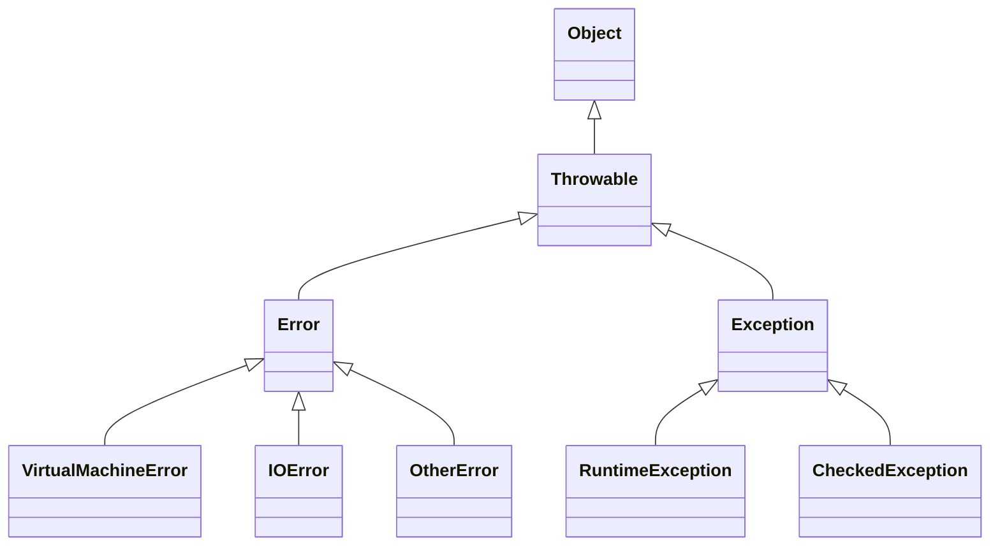

***
## 一、异常的概念

#### 1. 什么是异常 (Exception)？

- **异常(Exception)** 就是程序在执行过程中出现的不正常现象。而一套完善的异常处理机制，可以让程序变的更加健壮。

- 在 java 语言中，**异常是以类和对象的形式存在**。（异常类是模板，异常对象是具体的个体）

- 以下程序当除数为 0 时，执行到`int c = a / b;`的时候会发生算术异常。此时`JVM`底层会自动`new ArithmeticException()`对象，并将其抛出。
```java
public class TestApplication {  
    public static void main(String[] args) {  
        int a = 10, b = 0;  
        int c = a / b;  
        System.out.println(c);  
    }  
}
```
- 控制台显示异常
```bash 
Exception in thread "main" java.lang.ArithmeticException: / by zero
	at hnu.xingjj.test.TestApplication.main(TestApplication.java:10)
```

- 使用`throw`关键字可以手动模拟抛出异常的过程
```java
public class TestApplication {  
    public static void main(String[] args) {  
        NullPointerException e = new NullPointerException();  
        throw e;  
        // throw new NullPointerException()  // 合并，先创建再抛出
    }  
}
```

#### 2. 异常的继承结构



- **Throwable**：异常堆栈结构的老祖宗，所有 **异常(Exception)** 和 **错误(Error)** 都是可抛出的。

- **Error**：出现就立即退出JVM，程序员无权干涉也解决不了。
	
    - **VirtualMachineError**：虚拟机错误。
        - **OutOfMemoryError**：OOM，堆内存溢出 / 方法区内存溢出
        - **StackOverflowError**：栈溢出，如递归无结束条件
        - OtherError：其他错误
    - **IOError**：I/O错误
    - OtherError：其他错误
        
- **Exception**：程序员可以处理，方式有两种—— `throws`推卸责任 或 `try-catch`自己解决
    
    - **RuntimeException**（**运行时异常**、非受控异常、未检查异常）：编译期可选择处理或不处理，编译器不报  
        - **ClassCastException**：类型转换异常          
        - **NullPointerException**：空指针异常         
        - OtherError：其他错误    
    - **CheckedException**（**编译时异常**、受控异常、检查异常）：Exception的直接子类中除了RuntimeException之外的类，编译期必须预处理，否则编译器报错（异常仍发生在运行期）

