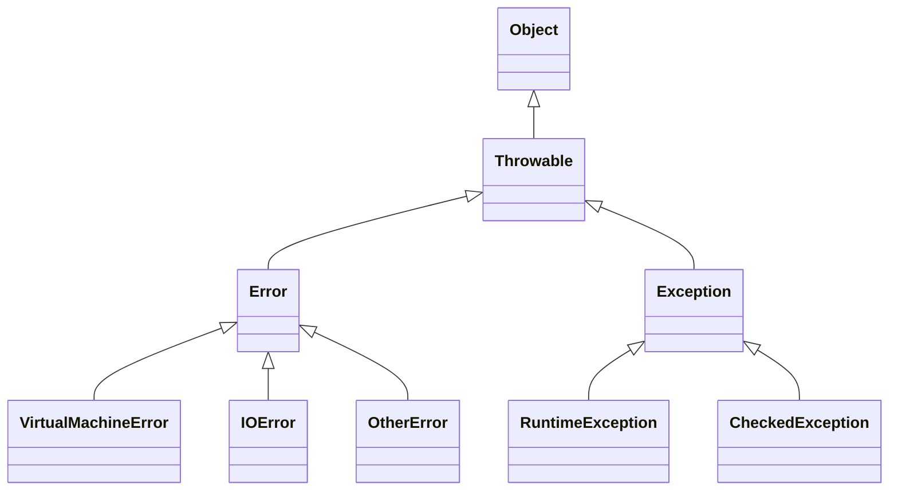

***
## 一、异常的概念

#### 1. 什么是异常 (Exception)？

- **异常(Exception)** 就是程序在执行过程中出现的不正常现象。而一套完善的异常处理机制，可以让程序变的更加健壮。

- 在 java 语言中，**异常是以类和对象的形式存在**。（异常类是模板，异常对象是具体的个体）

- 以下程序当除数为 0 时，执行到`int c = a / b;`的时候会发生算术异常。此时`JVM`底层会自动`new ArithmeticException()`对象，并将其抛出。
```java
public class TestApplication {  
    public static void main(String[] args) {  
        int a = 10, b = 0;  
        int c = a / b;  
        System.out.println(c);  
    }  
}
```
- 控制台显示异常
```bash 
Exception in thread "main" java.lang.ArithmeticException: / by zero
	at hnu.xingjj.test.TestApplication.main(TestApplication.java:10)
```

- 使用`throw`关键字可以手动模拟抛出异常的过程：**先创建异常对象，再将其抛出**。
```java
public class TestApplication {  
    public static void main(String[] args) {  
        NullPointerException e = new NullPointerException();  
        throw e;  
        // throw new NullPointerException()  // 合并，先创建再抛出
    }  
}
```

#### 2. 异常的继承结构



- **Throwable**：异常堆栈结构的老祖宗，所有 **异常(Exception)** 和 **错误(Error)** 都是可抛出的。

- **Error**：==**出现就立即退出JVM，程序员无权干涉也解决不了。**==
	
    - VirtualMachineError：虚拟机错误
        - OutOfMemoryError：OOM，堆内存溢出 / 方法区内存溢出
        - StackOverflowError：栈溢出，如递归无结束条件
        - OtherError：等等其他虚拟机错误
    - IOError：I/O错误
    - OtherError：等等其他错误
        
- **Exception**：程序员可以处理，方式有两种—— `throws`推卸责任 或 `try-catch`自己解决
    
    - **RuntimeException**（**运行时异常**、非受控异常、未检查异常）：编写程序时可选择处理或不处理，编译器不报错。==**如果不处理，只有当运行时异常真正发生时才会报错**==。  
        - ClassCastException：类型转换异常          
        - NullPointerException：空指针异常         
        - OtherException：等等其他运行时异常    
        
    - **CheckedException**（**编译时异常**、受控异常、检查异常）：**除了运行时异常之外**的异常类，编写程序时就必须预处理，否则编译器报错，==**如果不处理，编译器在编译时就会报错，无论异常是否会发生，程序都无法通过编译和运行**。
    
	- **运行时异常**的父类是**RuntimeException**，而**编译时异常**的父类是**Exception**，而CheckedException不是类名，只是一个叫法。

## 二、异常机制的操作

#### 1、自定义异常

- 在某些情况下，一些异常是和业务挂钩的，JDK中没有，需要去自定义。自定义的方法如下：
	
	- **第一步**：编写一个异常类去继承`Exception`或`RuntimeException`。
	- **第二步**：编写两个构造方法，一个无参，一个带String类型参数的构造方法。

```java
public class IllegalNameException extends Exception{  
  //自定义的无效用户名异常    
	public IllegalNameException(){}  
    public IllegalNameException(String msg){  
        super(msg);  
    }  
}
```

- 自定义异常的**类型选择**，继承`Exception`还是`RuntimeException`？
	
	- **编译时异常**：当这种异常是**外在因素导致的异常**，例如文件不存在，磁盘坏了，用户输入格式错误等异常情况，需要调用者合理恢复并处理。
	
	- **运行时异常**：当这种异常是**程序本身导致的异常**，与外界因素不相关。不强制调用者处理。
